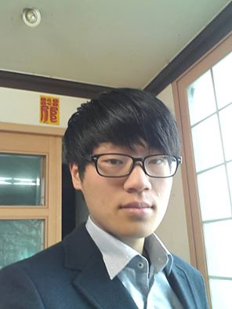

#Resuem
Jeju national university student

+   **Woochan Kim**

##Skill
  - Programming Language : C, C++, Java, PHP
  - Operating system : Windows, Linux
  - Networking programming  
    a little bit
  - Android programming  
    a little bit

##Education
  - Graduate Daykey high school

##Contact information
 - Email : woochankim200@gmail.com

##English level
 - TOEIC Score : 695

##Hobbies
 - Coding

 - Reading books  
  especially   IT related books

##Favorite books
[안드로이드 프로그래밍 정복](http://www.hanbit.co.kr/book/look.html?isbn=978-89-6848-003-4) : 김상형저 ,한빛 미디어
[리눅스 API의 모든것 세트](http://www.acornpub.co.kr/book/linux-api-set): 마이클 커리스크저 , 에이콘
